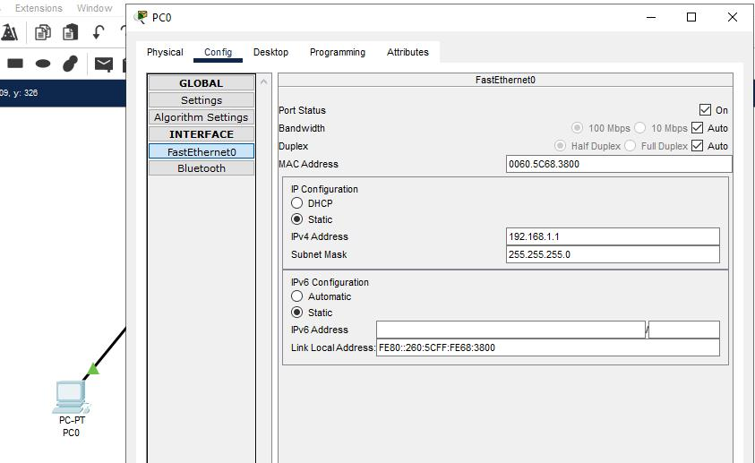

# DOCUMENTATION PACKET TRACER
## Topologi

Pada gambar di atas, terdapat 3 buah PC yang tersambung pada 1 Hub. Setiap PCnya mempunyai IP yang akan di set seperti di bawah ini.

Setelah disetting seperti di atas, lanjut ke skenario yang akan ditest.

## Scenario 1: PC0 -> PC1
Langkah pertama adalah check ARP pada PC0.

Kemudian ping IP PC1 melalui CMD PC0.

Maka pada simulasinya, awal pesan terbentuk berada pada layer 2.

Karena MAC IP Address Destinationnya belum ditemukan maka PC0 mengirim broadcast dengan broadcast address FFFF.FFFF.FFFF.

Setelah mendapatkan PC dengan IP 192.168.1.2 yaitu PC1, maka isi MAC Destination yang awalnya FFFF.FFFF.FFFF diubah dengan MAC dari PC1 yang dikembalikan sebagai pesan ke PC0.

## Skenario 2: PC0 -> PC1
Seperti biasa, di sini akan dicek ARP nya terlebih dahulu.

Karena di sini ARPnya sudah ada, maka PC0 tidak akan melakukan broadcast seperti saat pertama kali mencari MAC Destination.
Berikut isi dari paket ARP pada skenario ke-2 ini.

## Skenario 3: PC1 -> PC0
Sama seperti skenario di atas, hal pertama yang akan dicek adalah ARPnya.

Karena di sini ARPnya sudah ada, maka PC1 tidak akan melakukan broadcast seperti saat pertama kali mencari MAC Destination.
Berikut isi dari paket ARP pada skenario ke-3 ini.

