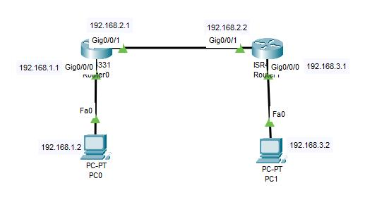
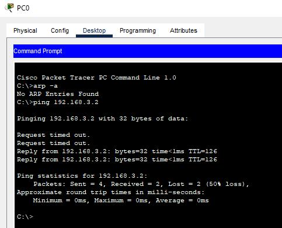

# Laporan Praktikum Konsep Jaringan

Pada gambar topologi di atas terdiri dari 2 PC Client dan 2 Router.

Berikut konfigurasi IPnya :

|Perangkat|Interfase|IP Address|Gateway|
|:-------:|:-------:|:--------:|:-----:|
|PC0|Fa0|192.168.1.2|192.168.1.1|
|PC1|Fa0|192.168.3.2|192.168.3.1|
|Router0|Gig0/0/0|192.168.1.1||
||Gig0/0/1|192.168.2.1||
|Router1|Gig0/0/0|192.168.3.1||
||Gig0/0/1|192.168.2.2||

Setelah itu, kita mengkonfigurasi routing staticnya dengan menggunakan konfigurasi di bawah ini.

Router0

    ip route 192.168.3.0 255.255.255.0 192.168.2.2

Router1

    ip route 192.168.1.0 255.255.255.0 192.168.2.1

Untuk mengecek apakah konfigurasi tersebut berhasil atau tidak, kita bisa langsung ping dari PC0 ke PC1.

Pada capture diatas, dapat kita lihat bahwa terjadi 2 kali RTO pada ping pertama dan kedua karena ping pertama dan kedua terjadi arp pada broadcast domain antara pc0 dengan router0 dan router0 dan router1. Pada ping selanjutnya baru terkoneksi secara langsung karena proses arp telah selesai dilakukan.