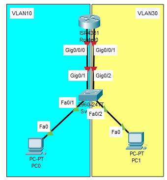

# Laporan Praktikum Konsep Jaringan (Intervlan)

## Apa itu Intervlan?
Intervlan adalah proses meneruskan lalu lintas jaringan dari satu VLAN ke VLAN yang lain menggunakan router.

## Jenis Intervlan
Intervlan terbagi menjadi beberapa jenis, yaitu:
1. Traditional Intervlan

2. Router-On-Stick (sering digunakan)

## Konfigurasi dengan Metode Router-on-stick
### Konfigurasi IP

### Konfigurasi Switch
Tambahkan vlan database (10->admin, 30->user)

Kemudian config interfacenya

### Konfigurasi Router (2)

