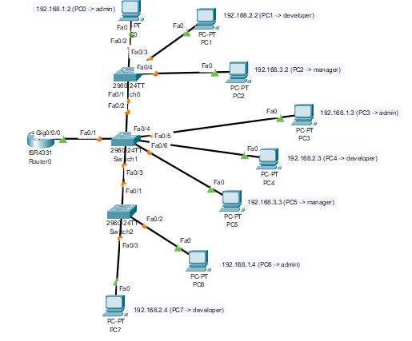

# Laporan Praktikum 6

## Topologi

|Devices|IP Address|Role|
|:-----:|:--------:|:--:|
|PC0|192.168.1.2|admin|
|PC1|192.168.2.2|developer|
|PC2|192.168.3.2|manager|
|PC4|192.168.1.3|admin|
|PC5|192.168.2.3|developer|
|PC6|192.168.3.3|manager|
|PC7|192.168.1.4|admin|
|PC8|192.168.2.4|developer|

## VLAN Database di Router dan Switch

|Devices|VLAN Number|VLAN Name|
|:-----:|:---------:|:-------:|
|Router0|10|admin|
||20|developer|
||30|manager|
|Switch0|10|admin|
||20|developer|
||30|manager|
|Switch1|10|admin|
||20|developer|
||30|manager|
|Switch2|10|admin|
||20|developer|
||30|manager|

## Add IP Address ke Router0
Dalam hal ini, kita akan menggunakan terminal untuk menambahkannya.

    Router# configure terminal
    Router(config)# interface gig0/0/0
    Router(config-if)# interface gig0/0/0.10
    Router(config-subif)# encapsulation dot1q 10
    Router(config-subif)# ip add 192.168.1.1 255.255.255.0
    Router(config-if)# interface gig0/0/0.20
    Router(config-subif)# encapsulation dot1q 20
    Router(config-subif)# ip add 192.168.2.1 255.255.255.0
    Router(config-if)# interface gig0/0/0.30
    Router(config-subif)# encapsulation dot1q 30
    Router(config-subif)# ip add 192.168.3.1 255.255.255.0
