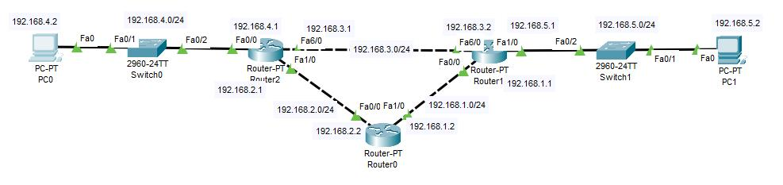
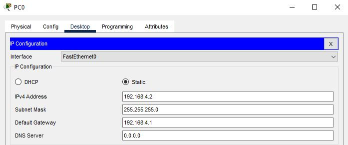
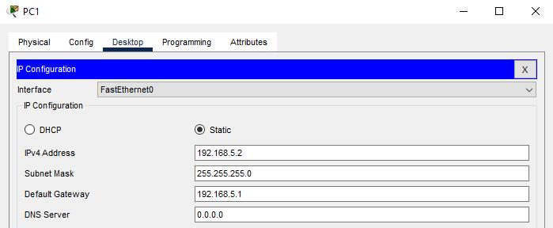
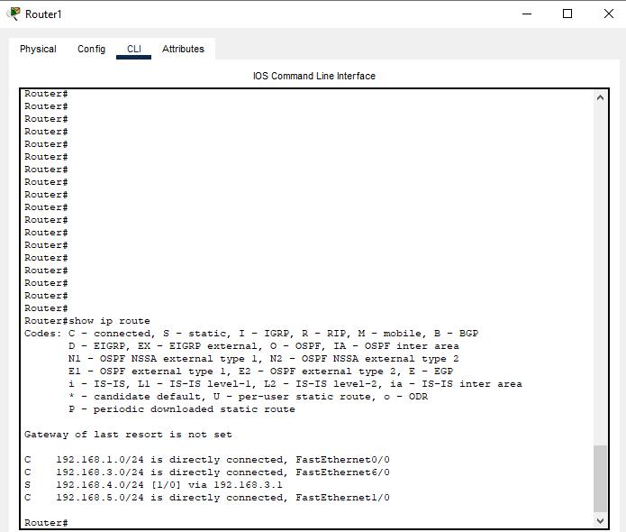
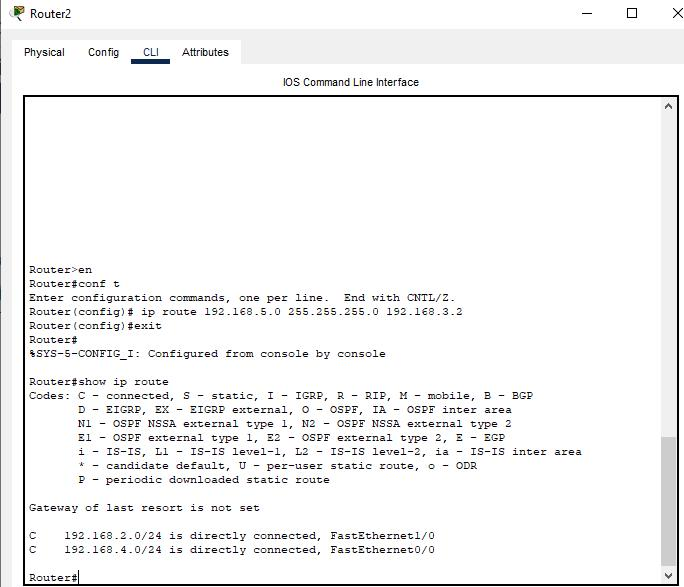
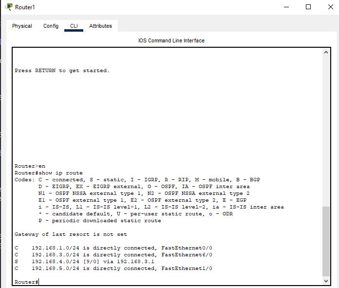
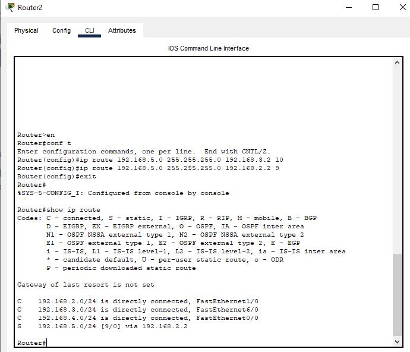

# Laporan Praktikum Minggu 8 (Static Routing)

## Topologi

## Langkah 1 : Konfigurasi masing-masing PC dan Router1 serta Router2
- konfigurasi PC0

Saya menyetting IP 192.168.4.2 untuk PC0.

- konfigurasi PC1

Saya menyetting IP 192.168.5.2 untuk PC1.

- konfigurasi Router1

      interface fa1/0
        ip address 192.168.5.1 255.255.255.0
        no shutdown
      interface fa6/0
        ip address 192.168.3.2 255.255.255.0
        no shutdown
      interface fa0/0
        ip address 192.168.1.1 255.255.255.0
        no shutdown

- konfigurasi Router2

      interface fa6/0
        ip address 192.168.3.1 255.255.255.0
        no shutdown
      interface fa0/0
        ip address 192.168.4.1 255.255.255.0
        no shutdown
      interface fa1/0
        ip address 192.168.2.1 255.255.255.0
        no shutdown

- konfigurasi routing static pada Router1 dan Router2

    *Router1*

      ip route 192.168.4.0 255.255.255.0 192.168.3.1

    *Router2*

       ip route 192.168.5.0 255.255.255.0 192.168.3.2

- show ip route pada Router1 dan Router2
  
  

## Langkah 2 : Trace Packet dari PC0 ke PC1

Menggunakan perintah *tracert 192.168.5.2*

## Langkah 3 : Konfigurasi Router0

    ip route 192.168.4.0 255.255.255.0 192.168.2.1
    ip route 192.168.5.0 255.255.255.0 192.168.1.1
    interface fa0/0
      ip address 192.168.2.2 255.255.255.0
      no shutdown
    interface fa1/0
      ip address 192.168.1.2 255.255.255.0
      no shutdown

Berikut tabel routing yang ada di Router0 :

## Langkah 4 : Konfigurasi Routing melalui Router0

1. Menghapus konfigurasi routing pada Router1 dan Router2

    *Router1*

        no ip route 192.168.4.0 255.255.255.0 192.168.3.1

    *Router2*

        no ip route 192.168.5.0 255.255.255.0 192.168.3.2

2. Menambahkan konfigurasi static routing baru

    *Router1*

        ip route 192.168.4.0 255.255.255.0 192.168.3.1 9
        ip route 192.168.4.0 255.255.255.0 192.168.1.2 10

    *Router2*

        ip route 192.168.5.0 255.255.255.0 192.168.3.2 10
        ip route 192.168.5.0 255.255.255.0 192.168.2.2 9

3. Mengecek tabel routing pada Router1 dan Router2

    *Router1*
    

    *Router2*
    

## Langkah 4 : Traceroute PC

1. PC0 -> PC1

2. PC1 -> PC0
