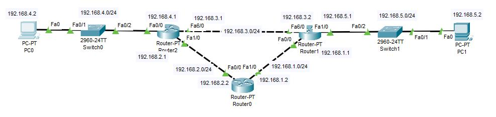
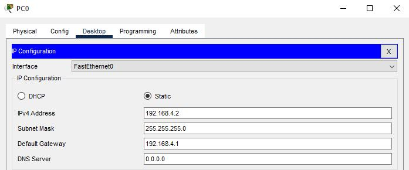
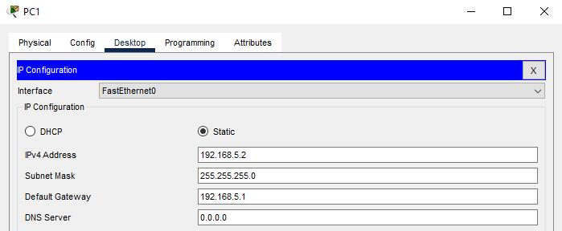
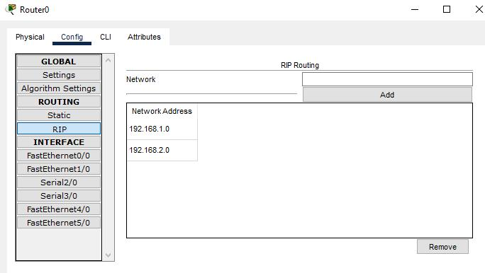

# Laporan Praktikum Minggu 9 (Dynamic Routing)

## Topologi

## Langkah 1 : Konfigurasi IP PC
- konfigurasi PC0

Saya menyetting IP 192.168.4.2 untuk PC0.

- konfigurasi PC1

Saya menyetting IP 192.168.5.2 untuk PC1.

  |Devices|Interface|IP|
  |:-----:|:-------:|:-:|
  |PC0|Fa0/0|192.168.4.2|
  |PC1|Fa0/0|192.168.5.2|

## Langkah 2 : Konfigurasi IP Router
|Devices|Interface|IP|
|:-----:|:-------:|:-:|
|Router0|Fa0/0|192.168.2.2|
||Fa1/0|192.168.1.2|
|Router1|Fa0/0|192.168.1.1|
||Fa1/0|192.168.5.1|
||Fa6/0|192.168.3.2|
|Router2|Fa0/0|192.168.4.1|
||Fa1/0|192.168.2.1|
||Fa6/0|192.168.3.1|

## Langkah 3 : Konfigurasi Routing (RIP)
|Devices|Network|
|:-----:|:-----:|
|Router0|192.168.1.0|
||192.168.2.0|
|Router1|192.168.1.0|
||192.168.3.0|
||192.168.5.0|
|Router2|192.168.2.0|
||192.168.3.0|
||192.168.4.0|

Cara mengkonfigurasinya bisa melalui gui ataupun terminal seperti berikut:

**Contoh Router0**

    router rip
      network 192.168.1.0
      network 192.168.2.0

  

## Langkah 4 : Testing

**Berikut hasil ping dari PC0 -> PC1:**

**Berikut hasil trace route PC0 -> PC1:**

# Kesimpulan
Dari hasil percobaan dapat disimpulkan bahwa routing dinamis lebih baik daripada routing statis. Routing dinamis dapat melakukan routing dengan cepat dan akurat. Sedangkan routing statis tidak dapat melakukan routing dengan benar karena tabel routing yang digunakan bersifat statis. Jadi jika ada perubahan jaringan, tabel routing harus diubah secara manual. Perutean dinamis memungkinkan Anda untuk melakukan perutean dengan cepat karena tabel perutean yang digunakan bersifat dinamis. Oleh karena itu, jika ada perubahan pada jaringan, tabel routing akan diperbarui secara otomatis.