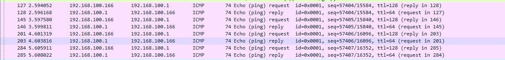

# DOCUMENTATION TASK
## Color Rules
Wireshark menggunakan warna untuk membantu mengidentifikasi jenis lalu lintas secara sekilas. Secara default, hijau adalah lalu lintas TCP, biru tua adalah lalu lintas DNS, biru muda adalah lalu lintas UDP, dan hitam mengidentifikasi paket TCP dengan masalah — misalnya, mereka bisa saja dikirim tidak sesuai pesanan.
| Color in Wireshark | Packet Type |
|:------------------:|:----------------------------------------------------------------------------:|
| Light purple | TCP |
| Light blue | UDP |
| Black | Packets with errors |
| Light green | HTTP traffic |
| Light yellow | Windows-specific traffic, including Server Message Blocks (SMB) and NetBIOS |
| Dark yellow | Routing |
| Dark gray | TCP SYN, FIN and ACK traffic |
| Red | Invalid Display Filter |

## Check IP Address | Default Gateway | Ping-it
 
Berdasarkan gambar di atas, ip laptop saya 192.168.100.166 dan default gatewaynya 192.168.100.1

## Packet Analyzer
 
Gambar di atas menunjukkan bahwa IP Address pada adaptor enp4s0 / ethernet yakni 192.168.100.166 dan default gatewaynya 192.168.100.1 dengan data tersebut kita bisa mengetahui packet yang terlintas pada Wireshark.

 
Dalam box frame terdapat:
- Arrival Time: Sep  5, 2022 20:17:36.981767000 SE Asia Standard Time
Menunjukkan waktu saat pengiriman data
- [Time delta from previous captured frame: 0.001120000 seconds]
[Time delta from previous displayed frame: 0.001120000 seconds]
[Time since reference or first frame: 2.594052000 seconds]
Menunjukkan waktu sebelum capture dari frame, yaitu 0.001120000 seconds, waktu setelah frame ditampilkan yaitu 0.001120000 seconds, dan waktu sejak awal frame 2.594052000 seconds.
- Frame Number: 127
Menunjukkan nomor dari frame tersebut yaitu 127.
- Frame Length: 74 bytes (592 bits)
Menunjukkan panjangnya frame adalah sebasar 74 bytes.
- [Protocols in frame: eth:ethertype:ip:icmp:data]
Menunjukkan protokol-protokol apa saja yang ada di frame 1 yaitu
ada Ethernet, Internet Protocol (IP), Internet Control Message Protocol
(ICMP) & Data.
- Kesimpulan:
Lapisan ini menunjukkan apa saja yang ada dalam satu frame yaitu seperti protokol-protokol yang ada di lapisan ini Ethernet, Internet Protocol (IP), Transmission Control Protocol (TCP), Hypertext Transfer Protocol (HTTP), dan data-text-lines.

 
Dalam box Ethernet II terdapat:
- Source: AzureWav_67:34:71 (40:9f:38:67:34:71), Destination: TendaTec_b7:94:d0 (04:95:e6:b7:94:d0)
Menunjukkan MAC dari source yaitu AzureWav_67:34:71 (40:9f:38:67:34:71) dan MAC dari destination TendaTec_b7:94:d0 (04:95:e6:b7:94:d0).
- Kesimpulan:
Lapisan data link MAC dari source yaitu AzureWav_67:34:71 (40:9f:38:67:34:71) dan MAC dari destination TendaTec_b7:94:d0 (04:95:e6:b7:94:d0).

 
Dalam box Internet Protocol terdapat:
- 0100 .... = Version: 4
Menunjukkan IP versi yang digunakan adalah versi 4
- .... 0101 = Header Length: 20 bytes (5)
Menunjukkan panjangnya header yang ada di lapisan network adalah sebesar 20 bytes
- InternetSrc: 192.168.100.166, Dst: 192.168.100.1
Menunjukkan IP dari source yaitu 192.168.100.166 dan IP dari destination
yaitu 192.168.100.1
- Kesimpulan:
Lapisan network, panjangnya header yang diberikan sebesar 20 bytes
dengan IP source 192.168.100.166 dan IP destination yaitu 192.168.100.1

Dalam box Internet Control Message Protocol terdapat:
- Type: 8 (Echo (ping) request)
- Code: 0
- Checksum: 0x6d1e [correct]
- Identifier (BE): 1 (0x0001)
- Identifier (LE): 256 (0x0100)
- Sequence Number (BE): 57404 (0xe03c)
- Sequence Number (LE): 7680 (0x3ce0)
- [Response frame: 128]
Dari data ICMP di atas saat echo ping request tersebut, icmp bertype 8, code 0, dengan
algoritma checksum 0x6d1e, banyak identifier (ident ifikasi) 256 bytes dan Sequence
number 57404 byte. Serta hasil diatas menunjukkan saat proses request ping, paket
dari source (192.168.100.166) IP address dari komputer kita akan merequest ({echo (ping)
request) ke destinat ion (192.168.100.1).